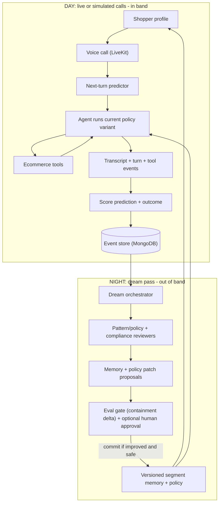
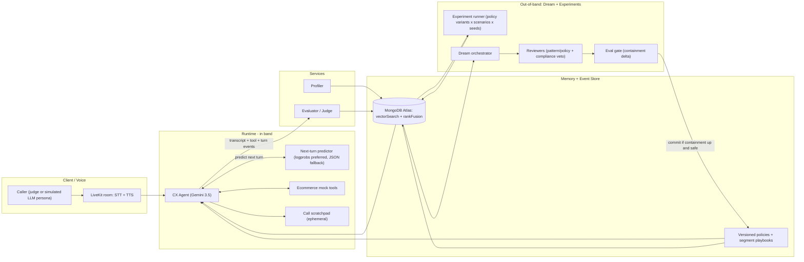

# CX-Lab Dojo

> A self-improving voice agent for retail and ecommerce support that learns by day and dreams by night. During calls it predicts the shopper's next move and captures evidence; between calls it "dreams" over transcripts to consolidate memory and promote safer, higher-containment policies. The same shopper profile gets contained better with every generation.

- Status: Draft for critique and feedback
- Context: AI Engineer World's Fair Hackathon 2026 - theme: Recursive Self-Improvement (RSI)
- Owners: TODO (team)
- Last updated: 2026-06-27

Reviewers: please attack (1) the sim-to-real / Goodhart argument, (2) whether next-turn prediction sounds like mind-reading, (3) whether the Day/Dream loop is genuinely self-improving vs dressed-up prompt tuning, and (4) the safety story. Open questions are in section 16.

---

## 1. Summary

Enterprises measure CX automation by containment - the share of contacts resolved in-channel without a human. Today's agents are reactive and static: one policy serves every shopper, and nothing learns across calls. CX-Lab Dojo makes the agent anticipatory and self-improving. For each shopper profile it (a) predicts the next turn (intent, sentiment, escalation/abandon risk, likely utterances), (b) runs a small set of named response policies across scenarios as experiments, (c) scores each call against a multi-objective rubric with hard safety prunes, and (d) runs an out-of-band "dream" pass that consolidates transcripts into better segment memory and promotes the winning policy. Containment climbs generation over generation, with minimal human intervention.

## 2. Problem and thesis

Most ecommerce support agents wait for the customer to express frustration, ask to escalate, or abandon. They do not learn what works for different shoppers, and a single session cannot see patterns across the fleet.

Thesis: make the agent anticipatory and let it improve out-of-band. For each profile, learn what the shopper is likely to say next, what emotional state they are moving toward, which responses reduce escalation, and which policy changes lift containment for that segment - then bake those lessons into memory between calls. We do not claim to predict exact words; we predict a calibrated distribution over the next turn.

## 3. Goals and non-goals

Goals:
- Anticipate the shopper's next turn and use it to plan better responses.
- Discover the best response policy per profile/scenario via simple, legible experiments.
- Improve automatically over time (measurable containment lift), safely.
- Produce reusable assets (better playbooks; optional preference data for fine-tuning).

Non-goals (hackathon): production telephony/SIP, real Shopify integration, PII/compliance certification, replacing a contact-center platform, large-scale fine-tuning.

## 4. Key concepts

- Containment / verified containment: resolved in-channel, no escalation, no immediate recontact, CSAT held.
- Profile / segment: a behaviour cluster from shopping history + demographics; each gets a `profile_id` and `persona_vector`.
- Next-turn prediction: a distribution over the shopper's next intent/sentiment/risk/utterances, produced before they speak.
- Policy variant: a named, legible response strategy (e.g., Empathy-first) - the unit we experiment over.
- Day/Dream loop: live calls capture evidence (day); a batch dream pass turns evidence into better memory and policies (night); future calls start smarter.
- In-band vs out-of-band: during a single call vs a separate batch process. The live agent never rewrites global memory mid-call.

---

## 5. The Day/Dream loop (the core)

```text
profile -> prediction -> conversation -> transcript -> evaluation -> dream consolidation -> policy update -> better next run
```



- Day (in-band): serve the shopper, predict the next turn, capture transcript + tool events, label actual intent/sentiment, score the prediction miss, write only safe call-scratch notes.
- Night (out-of-band "dream"): group transcripts by segment/scenario, review prediction misses, tool misuse, and policy failures; find repeated patterns; propose memory/policy patches with cited evidence.
- Next run: approved/eval-passed patches become better segment memory, better prediction priors, and a new champion policy version. Future calls show better-calibrated predictions, fewer turns, higher containment, fewer unsafe promises.

Why this is RSI: the output of using the system (transcripts, prediction errors, win/lose branches) is fed back through dreaming into the memory that drives the next conversations - so it gets better the more it is used, with minimal human intervention.

---

## 6. Architecture



Compute split: Gemini 3.5 for the conversation, simulated customer, and judge; DigitalOcean for batch inference (the experiment swarm), Evaluations (LLM-as-judge), and the logprob-capable prediction model; MongoDB Atlas (via the LiveKit starter) for voice-wired agentic memory and the event store.

---

## 7. Components

1. Voice runtime (LiveKit): realtime voice, transcript, turn-taking. Base on the `mongodb-hacker-starter` (voice + Atlas memory wired). Fallback: text input with transcript replay if voice slips.
2. Profiler: builds `profile_id` + `persona_vector` + segment from sample CRM/shopping data (loyalty tier, LTV, return rate, prior tickets, deadline, risk flags).
3. Next-turn predictor: outputs a distribution over intent, sentiment, escalation/abandon risk, and likely utterance candidates, before the shopper speaks.
   - Preferred: constrained classification - force the intent label as the first token and read `top_logprobs` (DigitalOcean OpenAI-compatible model or local Gemma 4), softmax over the taxonomy.
   - Fallback: strict JSON schema with normalized probabilities (used when logprobs are unavailable, e.g., on Gemini). The product is scored next-turn prediction, not token prediction - so this is not a single point of failure.
4. Policy variants (the experiment unit): named, legible strategies, shown as versions with diffs (not hidden in opaque prompts):
   - Policy-first (rules before action), Empathy-first (acknowledge then solve), Tool-first (look up order/options first), Retention-first (proactive offer to preserve the relationship).
5. Ecommerce tool layer (mock): order lookup, shipment status, refund status, return policy, replacement inventory, appeasement eligibility, escalation handoff. Tool events are recorded so dreaming can catch action failures (e.g., offered refund before checking policy; promised delivery without inventory evidence). Action-grounded containment is what makes this real CX, not generic chat.
6. Event store (MongoDB): collections for profiles, call_sessions, turn_events, prediction_snapshots, branch_scores, policy_versions, memory_patches, dream_runs.
7. Experiment runner: runs simulated calls per segment. MVP: 4 policy variants x 3 scenarios x 3 seeds = 36 branches. Full: 5 x 4 x 5 = 100. Runs on DigitalOcean batch inference.
8. Evaluator / judge: scores each turn (prediction vs actual) and each full call (rubric below).
9. Dream pass (out-of-band): orchestrator dispatches reviewers over grouped transcripts, proposes memory/policy patches with cited examples + prevalence stats. Keep it lean: a pattern/policy reviewer + a compliance reviewer with veto.

---

## 8. Memory layers and permissions

- L1 Call scratch (ephemeral): active-call facts (e.g., "birthday is tomorrow", "rejected coupon"). Writable by the live agent.
- L2 Shopper/segment memory: durable preferences (e.g., "high-LTV gift buyers value certainty over discounts"). Writable by dream pass; human can approve.
- L3 Segment playbook: shared per-segment guidance (markdown, progressive disclosure: front-matter always loaded, intent sections on demand). Writable only via approved/eval-passed dream patch.
- L4 Policy memory: the versioned response policy used by the agent (e.g., `policy_late_delivery_gen_3`). Writable only by the optimizer + gate.
- L5 Rubric memory: what the system is allowed to optimize (e.g., "do not maximize containment alone; low empathy caps the score; false promises are hard-prune"). Writable only by human or compliance-reviewed dream pass.

Guardrails (reused from Anthropic's memory/dreaming talk, adapted): versioning + rollback; concurrency via hash compare-and-swap for the parallel experiment swarm; permission tiers above; provenance (every patch links to evidence transcripts). The live agent never rewrites global memory mid-call.

---

## 9. Scoring

Prediction metrics (per turn):
```
NLL_t   = -log P_t(y_actual)                      # intent negative log-likelihood
Brier_t = sum_k ( P_t(k) - 1[k = y_actual] )^2
H_t     = -sum_k P_t(k) log P_t(k)                # entropy (uncertainty)
semantic_hit_t = max_i cosine(emb(candidate_i), emb(actual_utterance))
calibration_error_t = | confidence_top - actual_hit |
# logprob confidence when available: conf(c) = exp( mean_i log P(x_i | x_<i) )
```

Conversation reward (per call branch):
```
R = 0.30*containment + 0.20*resolution + 0.15*sentiment_recovery
  + 0.15*compliance + 0.10*prediction_quality + 0.05*efficiency
  + 0.05*revenue_or_retention - penalties

containment        = 1 if resolved without escalation else 0
sentiment_recovery = max(0, final_sentiment - min_sentiment_during_call)
prediction_quality = 1 - normalized(NLL + Brier - semantic_hit_bonus)
efficiency         = 1 - min(turns_to_resolution / max_turns, 1)
penalties          = hallucinated_policy + unsafe_discount + unresolved_repeat
```
Empathy and compliance gate the score: containment only counts if empathy and compliance pass.

Dream patch score (which updates to promote):
```
patch_score = 0.30*prevalence + 0.25*expected_reward_lift + 0.20*evidence_confidence
            + 0.15*recency + 0.10*severity - 0.30*compliance_risk

accept if patch_score >= 0.70 AND sessions_with_pattern >= 3 AND compliance_risk < 0.20
```
Demo path: auto-commit when a held-out containment eval improves. Production story: the same gate plus a human approval button (shown in the UI).

Continual-learning prior (closing the loop):
```
P_final = alpha*P_model + (1 - alpha)*P_empirical_segment
```

---

## 10. Pruning

- Hard prune (safety, immediate discard): policy violation; hallucinated refund/discount/delivery promise; toxic or low-empathy response; avoidable refusal causing escalation; privacy/security failure; unsupported claim about order/inventory/refund.
- Soft prune (statistical, avoid promoting lucky branches) via lower confidence bound:
```
LCB(policy) = mean_reward(policy) - 1.96 * sqrt(variance(policy) / n)
promote high-LCB policies; prune if LCB(policy) < mean_reward(champion) - margin
# hackathon: margin = 0.05, n = 10-20 calls per policy per generation
```
- Diversity guard (avoid brittle collapse): keep top-2 by reward, top-1 empathy, top-1 compliance, and 1 "interesting miss" (prediction wrong but recovery worked).

---

## 11. Demo narrative (judge plays the shopper)

Persona - Maya, 38, Gold loyalty, two kids, high LTV. Ordered a birthday gift; delivery is late; prior ticket unresolved; cancellation risk high.

1. Select Maya's profile; start a LiveKit voice call.
2. Judge: "My daughter's birthday is tomorrow and this still hasn't arrived."
3. UI shows prediction before the agent replies: deadline_pressure 44%, cancel_order 31%, refund 18%; sentiment frustrated; escalation risk 0.34.
4. Agent responds with the current policy; transcript lands; prediction is graded; branch tree updates.
5. Run ~36 simulated experiments for Maya-like profiles.
6. Click "Dream on these calls." Dream proposes a policy patch: remove "explain shipping policy first"; add "acknowledge deadline, check replacement inventory, offer expedited replacement before discount" - with cited transcripts + prevalence.
7. Eval gate passes (containment up); optional human approve.
8. Rerun the profile: containment Gen 1 52% -> Gen 2 68% -> Gen 3 81%.

Wow moment: "It predicted Maya's cancellation risk before she said it, found the repeated failure pattern, dreamed a safer policy, and contained the same profile better next generation."

---

## 12. Tech stack and prize mapping

- Gemini 3.5 ($5k): voice agent + simulated customer + LLM-as-judge; Live API for voice; Managed Agents (antigravity) with AGENTS.md/SKILL.md to orchestrate the dream pass.
- LiveKit (keyboards): realtime voice is core; champion policy runs as a live voice agent; build on `mongodb-hacker-starter`.
- DigitalOcean ($600): logprob-capable prediction model, batch inference for the experiment swarm (~50% cheaper), Evaluations (LLM-as-judge), App Platform deploy.
- MongoDB Atlas (bonus + speed): agentic memory ($vectorSearch + $rankFusion) and the event store, wired by the starter.

One project legitimately competes for Gemini + LiveKit + DigitalOcean while squarely hitting the RSI theme.

## 13. Competitive landscape (the wedge)

- CX agent platforms (potential customers): Sierra, Decagon, Cresta, Parloa, Intercom Fin.
- Simulation/testing/eval (our neighborhood): Hamming, Coval, Cyara/Botium, Cekura, Maxim, Future AGI, Merx.
- Gap they leave: they mostly evaluate and report ("does it work / did it regress"). None discover the optimal per-segment policy via legible self-play, grounded in tool/action outcomes, with an eval-gated dream loop that lifts containment over generations. That is our wedge.

---

## 14. MVP scope

Must build: retail profile selector; voice or simulated voice call with transcript capture; next-turn predictor panel; branch tree + scoreboard; experiment runner (20-36 synthetic calls); rubric evaluator with hard prunes; "Dream" button; memory/policy patch proposal with evidence; policy diff Gen 1 -> Gen 2/3; persistent event store (MongoDB or local fallback).

Should build: LiveKit voice path; MongoDB collections; DigitalOcean batch/deploy; ecommerce mock tools; preloaded demo data.

Cut if short: SIP/telephony; real Shopify; hard logprob dependency; >1 merchant; >5 profiles; auth; complex vector setup.

## 15. 48-hour build plan

- Phase 1 (0-2h) Define the box: 1 merchant, 5 profiles, 4 scenarios, 4 policy variants, 1 rubric, schema.
- Phase 2 (2-8h) Core sim: synthetic shopper, policy runner, mock tools, transcript/turn recording, event store.
- Phase 3 (8-14h) Prediction + scoring: predictor (logprob or JSON), intent/sentiment labeler, prediction + reward scoring, scoreboard.
- Phase 4 (14-22h) Dream pass: orchestrator + reviewers, patch format, eval gate, policy diff, approve button.
- Phase 5 (22-32h) UI: profile card, transcript, prediction, branch tree, scoreboard, dream visualization, policy diff.
- Phase 6 (32-40h) Voice + sponsor polish: LiveKit path (or polished replay), MongoDB, DO deploy, architecture README.
- Phase 7 (40-48h) Freeze + submit: preloaded data, 2-min video, public README, demo URL, 4-min pitch.

## 16. Risks and open questions

Risks and mitigations:
- Sim-to-real / Goodhart: different models for customer vs agent; multi-objective reward with empathy/compliance gates + hard prunes; rubric memory encodes "don't game containment"; validate on a few real transcripts if available.
- Logprob availability: preferred-with-fallback design (JSON schema) means Gemini's logprob unreliability cannot block us; verify a DO model's `top_logprobs` in hour 1.
- Over-scoping: legible policy variants (not open-ended search) and a 5-profile/1-merchant box keep it buildable.

Open questions for reviewers:
1. Does "next-turn prediction" read as defensible, or as mind-reading? How should we frame it?
2. Hero metric: containment lift, prediction accuracy, sentiment recovery, or turns-to-resolution?
3. Live voice vs polished transcript replay if time is tight?
4. "Dream" vs "Consolidation pass" for enterprise buyers?
5. Smallest version that still proves RSI?
6. Biggest safety objection a judge could raise, and our pre-empt?

## 17. Glossary

- Containment: resolved in-channel without escalation (verified adds no-recontact + CSAT held).
- Day/Dream loop: in-band evidence capture during calls; out-of-band consolidation between calls.
- Policy variant: a named response strategy that we experiment over.
- LCB: lower confidence bound, used to avoid promoting lucky branches.
- Rubric memory: explicit, inspectable constraints on what the system may optimize.
