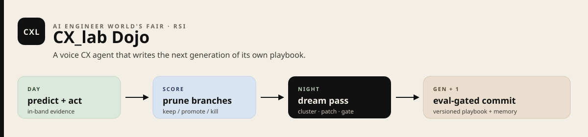
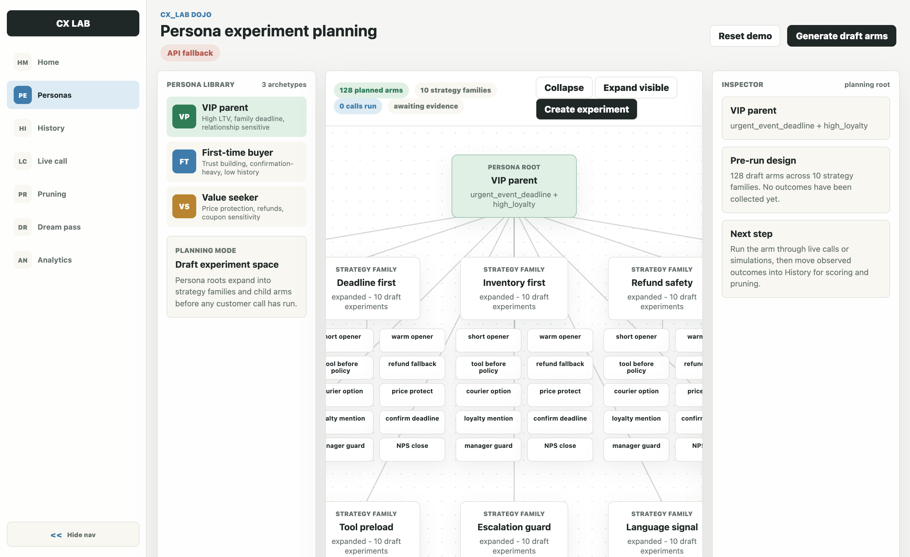
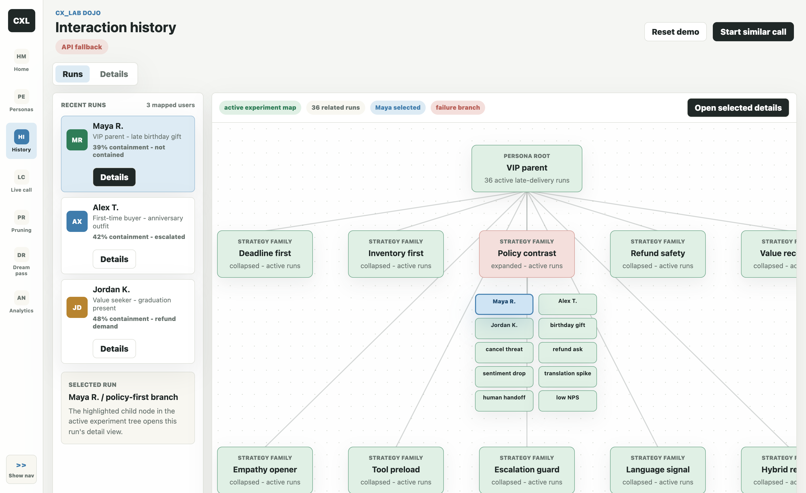
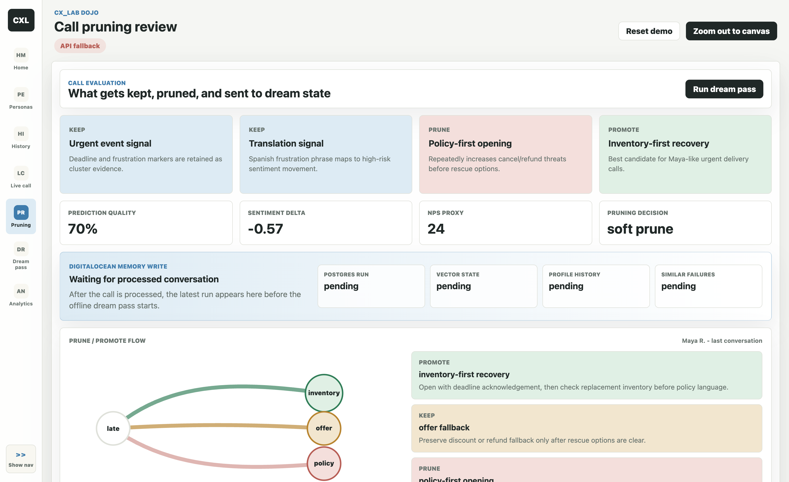
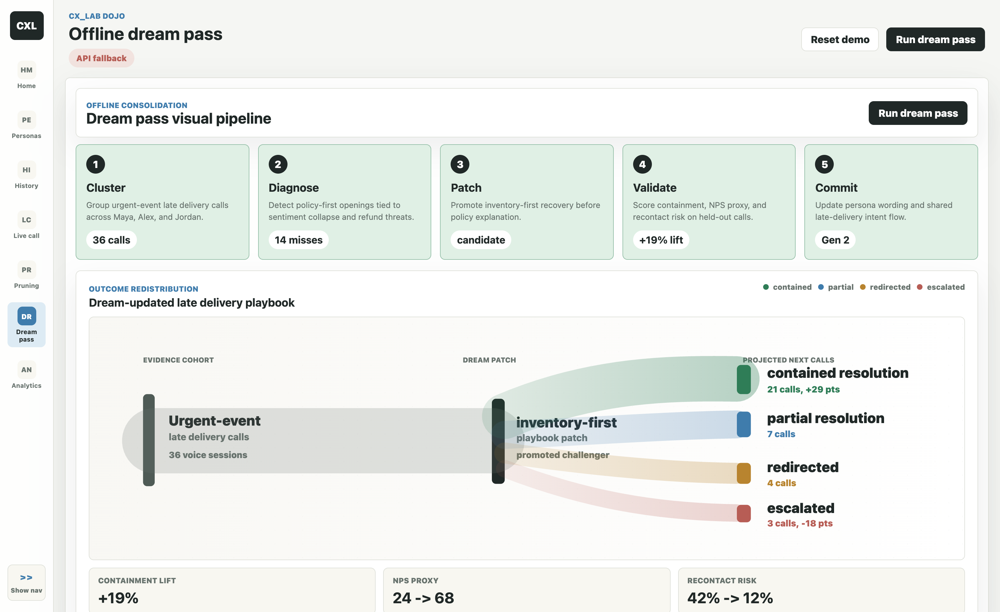
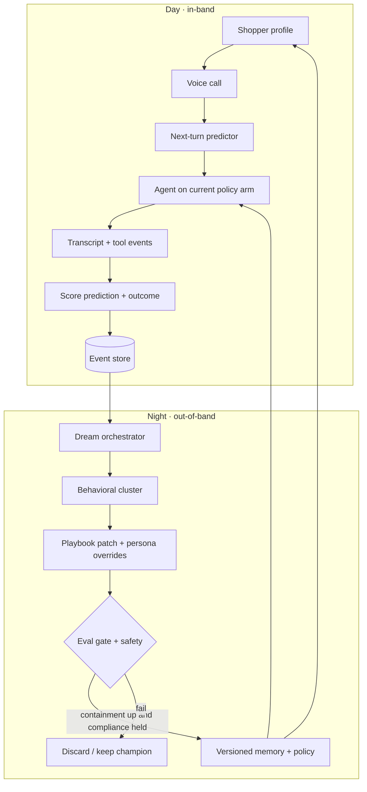
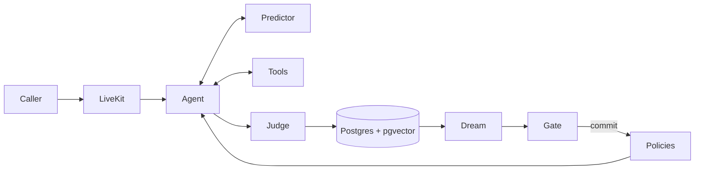

<p align="center">
  
</p>

<p align="center">
  Recursive self-improvement for retail voice agents.<br>
  AI Engineer World's Fair 2026, RSI track.
</p>

<p align="center">
  <a href="ui-final/index.html">Visual demo</a>
  ·
  <a href="DESIGN.md">Design notes</a>
  ·
  <a href="docs/GOLDEN_HACKATHON_SCRIPT.md">Golden demo script</a>
  ·
  <a href="docs/pitch.md">Pitch</a>
</p>

CX_lab Dojo is a lab for a containment agent that improves from its own failed calls.

**Try the evaluation lesson:** [When a better score still deserves a rejection](examples/policy-evaluation/). Run a baseline and two policy patches, inspect tool-action failures, and reproduce the promotion decision with Node.js alone. This is a synthetic regression exercise; the demo projections below are not measured customer outcomes.

During the day it predicts the shopper's next turn, runs a named policy, and writes a scored `ConversationResult`. At night a dream pass clusters those failures across personas, drafts a playbook patch, and commits only if a held-out eval lifts containment without breaking safety. The next live agent loads Gen N+1.

Learning is keyed on a behavioral failure cluster, not on a single shopper or persona label:

```text
intent : situation_tags : agent_strategy : failure_mode
```

Persona overrides change the wording of a patch. The cluster key decides whether a patch should exist.

## Demo

Static UI lives in [`ui-final/`](ui-final/). Open `ui-final/index.html`. No build step.

<table>
  <tr>
    <td width="50%">
      
      <br>
      <sub>128 draft arms across 10 strategy families, before any call runs.</sub>
    </td>
    <td width="50%">
      
      <br>
      <sub>Maya, Alex, and Jordan land in the same late-delivery tree.</sub>
    </td>
  </tr>
  <tr>
    <td width="50%">
      
      <br>
      <sub>Keep the deadline and language signals. Soft-prune policy-first. Promote inventory-first.</sub>
    </td>
    <td width="50%">
      
      <br>
      <sub>Cluster, diagnose, patch, validate, commit. Projected Gen 2 outcomes.</sub>
    </td>
  </tr>
</table>

Golden path from [`docs/GOLDEN_HACKATHON_SCRIPT.md`](docs/GOLDEN_HACKATHON_SCRIPT.md):

1. Maya (VIP parent, birthday gift late) hits a policy-first opener. Sentiment collapses. Not contained (39%).
2. Alex (first-time buyer) and Jordan (value seeker) fail the same way on different tickets.
3. Pruning keeps the urgent-event signal, soft-prunes policy-first, and promotes inventory-first recovery.
4. Dream pass groups 36 voice sessions, writes one playbook patch, and runs it through the eval gate.
5. The next similar caller gets inventory preloaded before policy language.

Held-out projection on that cluster (demo fixture):

| metric | before | after |
| --- | --- | --- |
| containment lift | baseline | +19% |
| NPS proxy | 24 | 68 |
| recontact risk | 42% | 12% |
| contained / partial / redirected / escalated | mixed | 21 / 7 / 4 / 3 of 35 |

## Why this is RSI

Recursive self-improvement, as used here:

1. The system produces artifacts from its own operation (transcripts, prediction errors, branch scores).
2. An out-of-band process reads those artifacts and proposes a change to the policy that will run next time.
3. A gate accepts or rejects the change on a metric the live loop cannot game mid-call.
4. The accepted change is versioned memory the next in-band agent actually loads.
5. Humans can approve or roll back. They do not have to author the patch.

The live agent never rewrites global memory mid-call. Dreaming is offline. Promotion requires the eval gate. Rollback is a policy version.

```text
profile → prediction → conversation → transcript
       → evaluation → dream consolidation → policy update
       → better next run
```



## Mechanism

### Search space

Before a call, the persona root expands into strategy families (Deadline first, Inventory first, Policy contrast, Refund safety, and others) and child arms (short opener, tool before policy, courier option, NPS close, and others).

The demo plans 128 draft arms across 10 families. Each arm is a named, diffable policy. Self-play and live traffic both write onto this tree.

```text
PERSONA ROOT          VIP parent
                      urgent_event_deadline + high_loyalty
        │
        ├─ Deadline first
        ├─ Inventory first          ← later champion
        ├─ Policy contrast          ← baseline failure branch
        ├─ Refund safety
        └─ …
```

### Next-turn prediction

Before the shopper speaks, the predictor emits a distribution over intent, sentiment, escalation/abandon risk, and utterance candidates. Preferred path: constrained classification + `top_logprobs`. Fallback: JSON schema probabilities (Gemini).

The live prior is a convex blend of model, profile, and intent-transition:

```text
P_final(intent) = α P_model + β P_profile + γ P_transition

demo weights:  α = 0.55   β = 0.25   γ = 0.20
```

Maya's opening turn in the golden script:

```text
"My daughter's birthday is tomorrow and the tracking says
 the package has not even shipped yet."
```

Predicted mass concentrates on deadline pressure, cancel, and refund. The agent is supposed to preload inventory and courier tools before she asks. Prediction quality is scored after the fact (NLL, Brier, entropy, semantic hit). The output is a calibrated distribution over the next turn.

### `ConversationResult`

The contract in [`packages/contracts`](packages/contracts) is what the loop writes. Person 1 streams turns. Person 2 (`packages/eval`) scores. Person 3 persists. One object carries:

```text
metadata
profile_snapshot
turns[].prediction_before_turn
turns[].prediction_score
turns[].pruning_signal
outcome
evaluation
pruning_decision
dream_input
```

Conversation reward (per branch):

```text
R = 0.30 containment
  + 0.20 resolution
  + 0.15 sentiment_recovery
  + 0.15 compliance
  + 0.10 prediction_quality
  + 0.05 efficiency
  + 0.05 revenue_or_retention
  − penalties

containment counts only if empathy and compliance pass.
false promises, hallucinated refunds, and toxic replies hard-prune.
```

### Pruning

After the transcript lands, the branch is labeled:

| state | meaning |
| --- | --- |
| `promote` | challenger beats champion on lower confidence bound |
| `preserve` | keep for diversity (top empathy, top compliance, or "interesting miss") |
| `soft_prune` | statistically weak; do not promote; still usable as evidence |
| `hard_prune` | safety / policy violation; discard immediately |

Soft prune uses a lower confidence bound so lucky branches do not become the playbook:

```text
LCB(policy) = mean_reward(policy) − 1.96 √(var / n)

promote if LCB(challenger) is high
prune   if LCB(policy) < mean_reward(champion) − 0.05
```

Maya's baseline call in the UI:

| keep | prune | promote |
| --- | --- | --- |
| urgent-event signal | policy-first opening | inventory-first recovery |
| translation / frustration spike | | offer fallback (kept, after rescue) |

```text
prediction quality  70%
sentiment delta    -0.57
NPS proxy           24
decision            soft prune
```

Policy-first was compliant. It still failed the call: explain shipping, miss the birthday, take a cancel threat. That miss is what dreaming reads.

### Dream pass

Dreaming is offline (`packages/dream`). The hackathon build does not fine-tune weights. It compiles a playbook patch from clustered failures.

Pipeline shown in the UI:

```text
1 CLUSTER     36 urgent-event late-delivery calls  (Maya, Alex, Jordan)
2 DIAGNOSE    policy-first openings ↔ sentiment collapse + refund threats   14 misses
3 PATCH       promote inventory-first recovery before policy explanation
4 VALIDATE    containment, NPS proxy, recontact on held-out calls           +19% lift
5 COMMIT      persona wording + shared late-delivery intent flow            Gen 2
```

Feature extraction (Gemini JSON, with a structured fallback) yields:

```text
intent
situation_tags[]
agent_strategy
failure_mode
persona
sentiment { before, after, delta }
```

Cluster key:

```text
${intent}:${sortedTags}:${agent_strategy}:${failure_mode}
```

Golden failure key:

```text
late_delivery:gift_order,urgent_event_deadline:policy_first_shipping_explanation:escalation_or_refund_threat
```

Maya is Gold / high LTV. Alex has no history. Jordan is coupon-sensitive. All three share that key because the broken move is the same: open with policy while an event deadline is on fire.

The patch is one global rule plus persona overrides:

```text
scope: intent_playbook_patch
rule:  for late delivery + urgent event, check inventory before shipping policy
tool_priority: order_lookup → local_inventory → replacement_shipping_options
avoid: standard_shipping_policy_first

loyal_shopper     → relationship recovery, refund fallback
first_time_buyer  → trust, status, confirmation
discount_shopper  → replacement value, price protection
```

Patch ranking:

```text
patch_score = 0.30 prevalence
            + 0.25 expected_reward_lift
            + 0.20 evidence_confidence
            + 0.15 recency
            + 0.10 severity
            − 0.30 compliance_risk

accept if patch_score ≥ 0.70
      and sessions_with_pattern ≥ 3
      and compliance_risk < 0.20
```

Demo path: auto-commit when held-out containment improves. Production story: the same gate plus a human approve button.

### Memory permissions

| layer | what | who writes |
| --- | --- | --- |
| L1 call scratch | ephemeral facts this call | live agent |
| L2 shopper / segment memory | durable preferences | dream, optional human |
| L3 segment playbook | markdown, progressive disclosure | approved / eval-passed patch only |
| L4 policy memory | versioned response policy (`policy_late_delivery_gen_3`) | optimizer + gate |
| L5 rubric memory | what may be optimized | human or compliance-reviewed dream |

Every patch cites evidence session IDs. Compare-and-swap on hashes for the experiment swarm. Rollback is `load Gen N-1`.

Continual-learning prior for the next day:

```text
P_final = α P_model + (1 − α) P_empirical_segment
```

The next day's predictor gets a better empirical prior once last night's cluster is committed.

## Architecture

```text
LiveKit / simulated voice
        │
        ▼
  apps/studio  +  ui-final          turns, predictions, branch tree
        │
        ▼
  apps/api                          ConversationResult boundary
        │
        ├── packages/eval           score, prune, dream_input
        ├── packages/simulator      synthetic arms × scenarios × seeds
        ├── packages/dream          cluster + patch (Gemini)
        ├── packages/memory         Postgres + pgvector
        └── packages/contracts      ConversationResult schema
```



What this repo actually wires:

- Gemini for the agent, simulated shopper, judge, and dream reviewer
- LiveKit for realtime voice (studio path)
- DigitalOcean Postgres + pgvector for the event store and similar-failure retrieval
- ElevenLabs / Google TTS behind `TTS_PROVIDER`

Out of hackathon scope: weights-level fine-tuning, SIP telephony, real Shopify, unsupervised memory commits with no rubric.

## Run

Visual demo, no keys:

```bash
open ui-final/index.html
```

Click Personas, History, Pruning, Dream pass. `Reset demo` restores the golden story.

Integrated stack:

```bash
cp .env.example .env          # Gemini, LiveKit, DATABASE_URL, …
npm install
npm run api:dev               # http://127.0.0.1:8000
npm run dev --workspace=apps/studio
```

`ui-final` talks to the API at `127.0.0.1:8000` when it is up, and falls back to the scripted golden path when it is not.

Contract and fixture:

```text
docs/conversation_result_contract.md
docs/conversation_result.example.json
data/fixtures/golden_demo_seed.json
```

## Repo map

```text
apps/studio                         voice UI, LiveKit client
apps/api                            persistence + dream HTTP boundary
packages/contracts                  ConversationResult schema
packages/eval                       blend, reward, prune
packages/simulator                  synthetic experiment swarm
packages/dream                      cluster → patch
packages/memory                     Postgres / pgvector
packages/integrations/livekit
packages/integrations/gemini
packages/integrations/digitalocean
ui-final/                           visual demo
docs/                               pitch, golden script, contract
DESIGN.md                           full RSI writeup
```

## Read next

| file | what |
| --- | --- |
| [`DESIGN.md`](DESIGN.md) | day/dream loop, scoring, pruning, safety objections |
| [`docs/GOLDEN_HACKATHON_SCRIPT.md`](docs/GOLDEN_HACKATHON_SCRIPT.md) | 4-minute Maya → Sam containment lift |
| [`docs/pitch.md`](docs/pitch.md) | RACX positioning: continuous resolution loops |
| [`packages/eval/README.md`](packages/eval/README.md) | blend weights and prune states |
| [`packages/dream/README.md`](packages/dream/README.md) | patch object and approval rule |
| [`docs/conversation_result_contract.md`](docs/conversation_result_contract.md) | ConversationResult contract |
